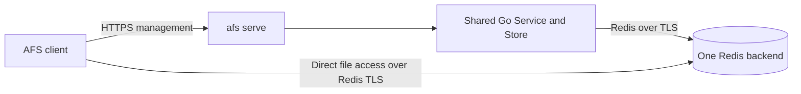

# Lightweight AFS control plane

Status: **draft proposal; not implemented or approved for implementation**.
Written 2026-09-16. This document records the proposed direction, its constraints
and the engineering decisions still needed. It does not change the current CLI.

## Purpose and scope

Make shared AFS workspaces easier to discover and administer without rebuilding
the original platform. Add an optional `afs serve` mode to the existing executable:
a small HTTPS management service using the same Go workspace and checkpoint
engine as the CLI. File access continues directly between clients and Redis over
TLS. Standalone, direct-to-Redis AFS remains the default.

Start with one administrator-configured Redis backend per server; one workspace
is one tree. Redis remains the only database. Keep the management surface
thin; concentrate design effort on enforceable storage permissions and correct
grant provisioning, revocation and restart recovery.

The first version is CLI first. A browser dashboard can follow later. Accounts,
organizations, volume composition, search, hosted MCP, templates, cloud
provisioning, multi-database management and broad provider integrations are out
of scope. This refines the original management/direct-Redis split; it is not a
new file data path.

## Verified starting point

The derivative was inspected at commit
[`09f1146`](https://github.com/rowantrollope/afs/tree/09f11466358f133ff66e0d4527fb517645bbfcd6).
Its [Service](../internal/controlplane/service.go) and
[Store](../internal/controlplane/store.go) retain Redis workspace metadata,
manifest/blob checkpoints and recovery. The original HTTP server, catalog,
tenancy, search and composition services were removed. Existing commands and
guarantees are described in the [README](../README.md) and
[native mount guide](native-mounts.md).

The original was inspected at
[`c3897ac`](https://github.com/redis/agent-filesystem/tree/c3897ac05265444568a3819c21728a38a4ed254b).
It has a separate control-plane executable, an embeddable browser app, multiple
Redis profiles and a SQLite/Postgres management catalog. An authenticated client
resolves a workspace through the API, receives its backing Redis configuration
and a read-only flag, then connects directly to Redis.

In the inspected implementation, session creation copies the configured Redis
profile's username/password into the response; the CLI uses those credentials.
API authentication is real, but it does not establish separate storage isolation
after those credentials have been supplied. Heartbeat failures are logged;
closing a session updates presence and audit state rather than revoking the
Redis credentials. These are source observations, not claims about any particular
deployment's credentials or exposure. See the [original source references](#original-source-references).

## Original versus proposed

The original column describes that inspected revision. Every entry in the
proposed column is a design choice or requirement, not delivered functionality.

| Area | Original control plane | Proposed lightweight control plane |
| --- | --- | --- |
| Purpose | Broad workspace platform and administration | Discovery, explicit access grants and workspace/checkpoint management |
| Executable and deployment | Separate `afs-control-plane` executable; embeds the web app when built | Optional `afs serve` in the existing executable; reuse Go Service/Store |
| Backing databases | Multiple Redis profiles through `DatabaseManager` | One configured Redis backend per server initially; changing backing storage requires migration |
| Management metadata | SQLite by default; optional Postgres catalog for workspaces, sessions, tokens and registries | Existing Redis workspace metadata plus protected grants, expiring presence and bounded management events; no second catalog |
| Workspace composition | Workspaces can compose volumes | One workspace is one tree |
| Management transport | HTTP API; HTTPS can be supplied at the deployment boundary | HTTPS required; TLS termination arrangement remains open |
| File data path | Client connects directly to resolved Redis | Client connects directly to configured Redis over TLS |
| Credentials | Session response includes configured backend credentials | Persistent restricted Redis identity per device/agent and workspace grant; never distribute service administrator credentials |
| Permissions | API authorization and a client read-only flag; actual Redis limits depend on supplied credentials | API checks management permissions; Redis ACLs enforce file access; checkpoint, restore and delete permissions are separate |
| Revocation | Session close does not revoke supplied Redis credentials | Complete only after identity revocation and termination of authenticated connections; backend-specific mechanism |
| Heartbeats | Session presence/activity; failure does not stop file I/O in the inspected client | Presence only; expiry does not revoke access or renew credentials |
| Management server outage | Established Redis access can continue | Same; discovery, management and credential changes are unavailable |
| UI | React/TanStack browser application; API-only fallback if UI assets are absent | CLI first; optional browser dashboard later |
| Extra features | Cloud-connected workflows, search, MCP, templates and broader registries | Excluded from initial scope |
| Principal complexity | Platform breadth, catalogs, profiles and composition | Real storage permissions and restart/revocation correctness |

## Architecture and boundaries

The HTTP handler authenticates the requester, checks management permissions and
calls the retained engine. Managed client configuration names an AFS server
endpoint; exact flags, configuration fields and HTTP routes remain open. CLI
and server share storage and lifecycle behavior;
they do not maintain separate implementations. Client-local work, such as
flushing a mount's pending edits, remains a client responsibility.

Managed discovery reads existing workspace metadata and exposes only workspaces
the requester is permitted to discover. The server uses its configured backend;
it does not choose a database per mount. Grant bindings must identify the actual
workspace, not just a reusable display name. Repointing configuration to another
database with matching names is not a migration. Moving storage requires an
explicit procedure covering workspace identity, data and grants; that procedure
is still to be designed.

### Minimal management records

| Record | Conceptual contents | Lifetime and protection |
| --- | --- | --- |
| Workspace | Existing workspace identity and metadata | Reuse current Redis metadata and discovery; no duplicate catalog |
| Access grant | Device/agent identity, one workspace, permissions and provisioning/revocation state | Persistent until explicitly revoked; writable only by authorized management operations |
| Presence | Workspace, client label and last seen | Expires; informational only |
| Management event | Requester, operation and outcome, with time and relevant workspace/grant reference | Bounded retention; protected from data-client mutation |

These are conceptual records, not a finalized schema. Access grants distinguish
filesystem read/write from checkpoint creation, restore, checkpoint deletion and
workspace deletion privileges.
File write access must not implicitly confer lifecycle or grant administration.
Authentication, token format, initial operator bootstrap, secret storage, record
persistence and reconciliation remain open engineering decisions. Presence
updates pass through the authenticated API; client labels are descriptive, not
proof of identity. Exclude credentials from events and logs, and verify TLS
certificates on management and Redis connections.

### Connection and grant lifecycle

An authorized management action creates an explicit grant for a device or agent
and one workspace. The server provisions a restricted Redis identity and verifies
its effective permissions before reporting the grant as usable. The client
authenticates to the management API to discover authorized workspaces and obtain
the relevant connection details, then uses its restricted identity for direct
Redis access. How credentials are securely delivered, stored and recovered is
not yet specified.

Grants survive reconnects until revoked. Mounting does not create an ephemeral
Redis user, and presence heartbeats do not drive credential renewal. A client
that already has valid connection details may retain direct Redis access while
management is unavailable, subject to Redis availability and existing filesystem
correctness checks.

## Storage permissions are the central design work

Redis ACLs can restrict commands, key access and Pub/Sub channels. The proposed
grant must constrain all three. A broad wildcard for the workspace is inadequate:
file and management keys currently share the same hash tag. The
[client key builder](../mount/internal/client/keys.go) uses
`afs-lite:{workspaceID}:...` for inodes, content, directory entries, the change
journal, invalidation channels, generation and native sessions. The
[Store key helpers](../internal/controlplane/store.go) put workspace metadata,
checkpoint manifests and blobs under that hash tag too.

Define permissions by actual key purpose. Data clients must not modify grants,
management metadata, checkpoint manifests/blobs or lifecycle generation records.
They may need narrowly scoped reads of lifecycle state and writes to their own
coordination records. The exact key layout, command allowlist and separation
between per-client and shared coordination remain to be designed and tested.

Two existing behaviors prevent treating this as a simple ACL configuration task:

- [WarmPathCache](../mount/internal/client/native_helpers.go) performs a
  database-wide `SCAN` with an inode-prefix match. ACL key patterns do not filter
  keyless, database-wide commands; a client-controlled match is not an isolation
  boundary. Restricted clients need scoped traversal or another appropriate
  replacement for that behavior. See [Redis SCAN](https://redis.io/docs/latest/commands/scan/)
  and [ACL key permissions](https://redis.io/docs/latest/operate/oss_and_stack/management/security/acl/#key-permissions).
- [Native sessions](../mount/internal/client/native_session.go) create and renew
  lease keys and use generation checks and Lua. Read-only filesystem access may
  still require narrowly scoped coordination writes. Denying every Redis write
  command is not a demonstrated native read-only mounting policy.

The permission design must cover scripts, transactions, optional Redis Array
commands and channel access, including denial of operations beyond the grant.
Existing generation and native lease fencing remain filesystem correctness
mechanisms. Control-plane presence is a separate concept and must not replace
or weaken them. Correctness checks in a cooperating client do not substitute
for authorization against someone issuing raw Redis commands with its credentials.

## Revocation and recovery

Record durable revoke intent and reject subsequent management use before
changing backend access. A grant is fully revoked only when its Redis identity
can no longer authenticate and its authenticated connections have been cut off.
Revoking an API token alone
does not remove direct Redis access. Incomplete backend revocation must remain
visible and retryable; already downloaded files cannot be recalled. On native Redis,
[`ACL DELUSER`](https://redis.io/docs/latest/commands/acl-deluser/) removes a user
and terminates its connections; merely marking a user `off` leaves existing
authenticated connections working, as documented in the
[ACL rules](https://redis.io/docs/latest/operate/oss_and_stack/management/security/acl/#acl-rules).

Redis Software and Redis Cloud do not expose `ACL DELUSER` in the same way;
their [command compatibility reference](https://redis.io/docs/latest/operate/rs/references/compatibility/commands/server/)
lists it as unsupported. Those deployments need their supported identity-management
API, with verified connection termination behavior. Isolate this integration and
support one credential-management mechanism initially. Selecting that mechanism
is still open. This proposal does not promise generic Redis Cloud support or
instant revocation across providers.

The correctness requirement is durable revocation: a revoked grant must never
be recreated by server or Redis restart recovery. Partial provisioning and failed
revocation need explicit, observable states and verification before success is
reported. An interrupted operation must not silently become an active grant.
The persistence order, retry rules and reconciliation state machine are not yet
designed. Redis data persistence, identity persistence and recovery from backups
must be considered together; a remembered grant record alone is not proof that
the effective Redis permissions match it.

| Condition | Required behavior |
| --- | --- |
| Heartbeat expires | Mark presence stale; leave the grant unchanged |
| Management server is unavailable | Established Redis file access may continue; discovery, management and credential changes are unavailable |
| Redis is unavailable | Redis-dependent file access and management cannot complete; local pending edits are not a successful publication |
| Grant provisioning partly fails | Expose incomplete state; do not report usable access before verification; reconcile any provisioned identity |
| Revocation partly fails | Report incomplete revocation; retain durable intent and retry/repair rather than claiming access ended |
| Server or Redis restarts | Reconcile durable intent with effective identities; never recreate a revoked grant |
| Workspace is restored or deleted | Preserve existing generation fencing; stale clients must not republish into the changed lifecycle |

## Checkpoints, history and honest guarantees

A remotely requested checkpoint snapshots published Redis state. It cannot
silently flush pending edits on every remote client or guarantee a distributed,
application-consistent snapshot. The current CLI flushes matching local mounts
before checkpoint creation; that local behavior does not become a fleet-wide
barrier merely because an HTTP endpoint invokes the engine. Applications still
need explicit coordination when consistency across clients matters. Restore and
delete must preserve existing lifecycle safeguards and stale-client handling.
See the [current checkpoint semantics](../README.md#checkpoints-and-forks).

File-change history can read the existing change journal. Client attribution is
reported information, not a tamper-proof audit of every direct Redis access.
The server's bounded management events cover requests it handles and their
outcomes; they do not imply comprehensive data-access auditing.

## Open engineering decisions

1. Management authentication and token format; bootstrap operator identity;
   credential delivery, rotation, storage and recovery; HTTPS termination.
2. The first supported identity-management mechanism and its persistence,
   connection termination and failure semantics.
3. Exact command/key/channel permissions, read-only coordination, scoped cache
   traversal and any necessary key or client changes.
4. Grant state transitions and durable ordering across records and identities;
   restart reconciliation, partial failure and backup recovery without resurrection.
5. Minimal API/CLI shape, management permission vocabulary, bounded event
   retention and an explicit storage migration procedure.

These decisions should resolve the access and recovery contract before the
HTTP directory or optional UI expands. No implementation schedule or estimate is
implied by this draft.

## Future implementation acceptance criteria

These are proposed gates for later implementation, not tests run for this
documentation change. Use disposable infrastructure and the selected backend's
actual identity-management mechanism.

- Pass build, vet, unit/race and isolated real-Redis process checks; preserve
  existing multi-writer, batching, chunking and recovery guarantees.
- Verify shared engine behavior for CLI and HTTP workspace/checkpoint actions,
  with standalone direct-to-Redis workflows retained.
- Demonstrate read/write and read-only grants through folder sync and supported
  native mounts, including scripts, transactions, optional Array commands,
  cold hydration, warm recovery, cache warming and Pub/Sub invalidation.
- Prove cross-workspace command/key/channel denial and protection of grants,
  management records, checkpoint manifests/blobs and lifecycle generation keys.
  Include direct Redis commands and global keyspace enumeration attempts, not
  only cooperative CLI behavior. Verify that a read-only grant cannot change
  file bytes or filesystem metadata, that coordination writes are limited to
  their intended scope, and that one client cannot manipulate another's leases.
- Revoke a grant with an already-authenticated connection; prove that connection
  loses access, including Pub/Sub, and that reconnect fails while unrelated
  grants keep working. API-token revocation alone does not pass.
- Inject failures during provisioning and revocation; restart server and Redis
  at intermediate states. Prove retries and recovery never resurrect revoked
  access and never report unverified success.
- Stop management and expire presence while clients use Redis; demonstrate the
  stated outage behavior without conflating presence with native lease fencing.
- Demonstrate checkpoint limits with pending remote edits and preserve existing
  restore/delete fencing and recovery semantics.
- Verify TLS certificate validation, secret redaction and bounded event retention;
  permission failures must never fall back to broader credentials.

## Original source references

Links below are pinned to the inspected original commit. Derivative source links
above are repository-relative so they remain usable in a checkout or on GitHub;
the baseline commit is recorded under [Verified starting point](#verified-starting-point).

- [Control-plane executable](https://github.com/redis/agent-filesystem/blob/c3897ac05265444568a3819c21728a38a4ed254b/cmd/afs-control-plane/main.go): separate server; its listener is plain HTTP, so HTTPS requires deployment configuration.
- [Catalog interface and driver selection](https://github.com/redis/agent-filesystem/blob/c3897ac05265444568a3819c21728a38a4ed254b/internal/controlplane/catalog_store.go#L21-L85): management records and SQLite/Postgres backends.
- [UI embedding](https://github.com/redis/agent-filesystem/blob/c3897ac05265444568a3819c21728a38a4ed254b/internal/uistatic/uistatic.go#L1-L12), [API-only fallback](https://github.com/redis/agent-filesystem/blob/c3897ac05265444568a3819c21728a38a4ed254b/internal/controlplane/http.go#L251-L269) and [UI dependencies](https://github.com/redis/agent-filesystem/blob/c3897ac05265444568a3819c21728a38a4ed254b/ui/package.json#L30-L37): build-dependent React/TanStack browser interface.
- [Token checks](https://github.com/redis/agent-filesystem/blob/c3897ac05265444568a3819c21728a38a4ed254b/internal/controlplane/cli_tokens.go#L272-L306) and [session policy](https://github.com/redis/agent-filesystem/blob/c3897ac05265444568a3819c21728a38a4ed254b/internal/controlplane/cli_tokens.go#L557-L572): original management authentication and permissions.
- [DatabaseManager](https://github.com/redis/agent-filesystem/blob/c3897ac05265444568a3819c21728a38a4ed254b/internal/controlplane/database_manager.go#L1276-L1335): workspace resolution and profile credentials in session responses.
- [Service session response](https://github.com/redis/agent-filesystem/blob/c3897ac05265444568a3819c21728a38a4ed254b/internal/controlplane/service.go#L634-L652) and [session close](https://github.com/redis/agent-filesystem/blob/c3897ac05265444568a3819c21728a38a4ed254b/internal/controlplane/service.go#L846-L873): Redis configuration, read-only flag and session bookkeeping.
- [Client connection setup](https://github.com/redis/agent-filesystem/blob/c3897ac05265444568a3819c21728a38a4ed254b/cmd/afs/sync_lifecycle.go#L90-L101) and [heartbeat loop](https://github.com/redis/agent-filesystem/blob/c3897ac05265444568a3819c21728a38a4ed254b/cmd/afs/managed_session.go#L55-L95): direct Redis configuration and heartbeat error handling.
- [Control-plane API reference](https://github.com/redis/agent-filesystem/blob/c3897ac05265444568a3819c21728a38a4ed254b/docs/reference/control-plane-api.md): original API surface and session workflow.
